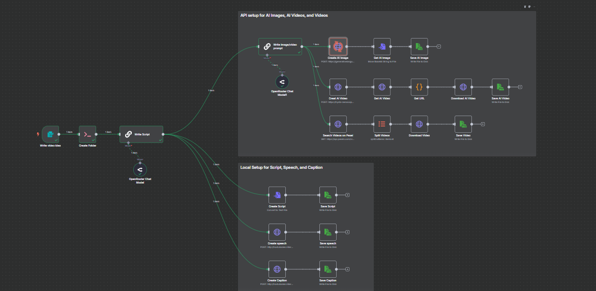

# 🎬 YouTube AI Automation Workflow (n8n +  Gemini + Flask + AI)

This project automates the full content creation pipeline for **YouTube videos** using AI.  
It integrates OpenRouter for AI text generation, gTTS for voiceovers, and custom Python Flask services for **script-to-audio** and **script-to-subtitles (SRT)**.  
An end-to-end AI automation pipeline for **YouTube short-form content**
All processes are orchestrated using **n8n**, hosted locally via Docker.

> ✅ Ideal for faceless YouTube automation, content repurposing, or rapid short-form video generation.

---

## 🧠 What It Does

- ✍️ Generates **AI-written video scripts**
-  📸 AI-generated images
- 🎞 AI-generated or stock videos
- 🎙 Converts scripts into **audio (MP3)** using TTS
- 📄 Converts scripts into **subtitles (SRT format)**
- 🖼 Generates **AI images/videos** from prompts (via API)
- 🎥 Combines assets for complete YouTube-ready content
- 🧩 Runs using a visual workflow in **n8n**

---

## 🖼 Workflow Diagram



- **Top Area** = API setup (AI images, videos)
- **Bottom Area** = Local services (script, audio, subtitle)
- **Left Area** = Entry point (video idea → AI flow)

---
## 🧠 Core Features

| Module           | Description                                      |
|------------------|--------------------------------------------------|
| `Write Script`   | Generates short 50-70 word reels using GPT       |
| `Create AI Image`| Sends Gemini prompt to generate photo            |
| `Create AI Video`| Uses HuggingFace ZeroScope to generate clip      |
| `TTS`            | Uses Flask + gTTS to generate `.mp3` speech      |
| `Subtitles`      | Flask app converts script to `.srt` (timed)      |
| `Stock Videos`   | Downloads from Pexels based on prompt        

---

## 🐳 How to Run n8n with Docker
Make sure you have [Docker](https://docs.docker.com/get-docker/) installed.


Run n8n locally on port `5678` and mount persistent storage:

```bash
docker run -it --rm -p 5678:5678 -v C:\Users\gamin\.n8n:/home/node/.n8n n8nio/n8n       ** add your path
```

Then run the following in your project root:

```bash
docker-compose up --build
```

🧪 Running Flask Services
📜 1. Script-to-SRT (Subtitles)
```bash
cd services/
python script-to-srt.py
```

🔊 2. Text-to-Speech (Audio)
```
cd services/
python text-to-speech.py

```

### ⚙️ APIs Used
Tool	Purpose	Endpoint
- 🧠 OpenRouter / Gemini	Script & Image Prompt	OpenRouter Chat Model
- 🎨 Gemini Flash	Image Generation	v1beta/models/gemini-2.0-flash-exp-image-generation
- 🎥 HuggingFace ZeroScope	Video Creation	https://hysts-zeroscope-v2.hf.space/gradio_api/call/run
- 📦 Pexels API	Stock Videos	https://api.pexels.com/videos/search
*-*
